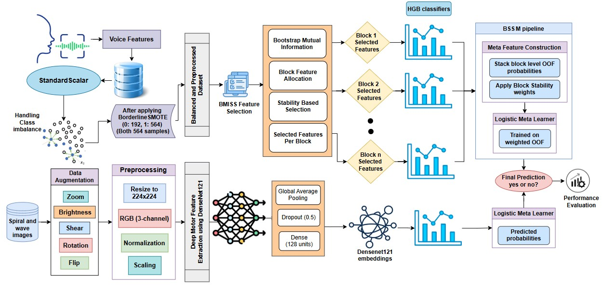

# Stacked Ensemble Parkinson's Disease Detection

## About the Project

* Developed an ensemble framework for Parkinson's Disease detection using speech and motor biomarkers.
* Introduces BMISS (Block Mutual Information with Stability Selection) for robust speech feature selection.
* Utilizes BSSM (Block Stability Stacked Model) for ensemble-based speech classification.
* Employs DenseNet121 transfer learning for motor drawing analysis using spiral and wave images.
* Combines machine learning and deep learning techniques to support accurate Parkinson's Disease classification.

---

## Why This Project?

* Parkinson's Disease affects both speech and motor functions.
* Single-modality approaches may miss important disease indicators.
* Combining speech and motor information can improve detection reliability.
* Supports research toward non-invasive and early-stage Parkinson's Disease screening.

---

## Architecture

  

---

## Datasets

### Parkinson's Disease Speech Signal Features Dataset

Speech feature dataset containing baseline, intensity, formant, bandwidth, vocal fold, MFCC, wavelet, and TQWT features.

**Dataset Link:**
https://www.kaggle.com/datasets/dipayanbiswas/parkinsons-disease-speech-signal-features

### Parkinson's Drawings Dataset

Motor drawing dataset containing spiral and wave drawings from healthy subjects and Parkinson's Disease patients.

**Dataset Link:**
https://www.kaggle.com/datasets/kmader/parkinsons-drawings

---

## Key Technologies Used

* Python
* Scikit-Learn
* TensorFlow / Keras
* DenseNet121
* HistGradientBoosting Classifier
* Logistic Regression
* BorderlineSMOTE
* NumPy
* Pandas
* Matplotlib
* Seaborn

---

## Evaluation Metrics

* Accuracy
* Precision
* Recall
* F1-Score
* ROC-AUC Score
* Confusion Matrix
